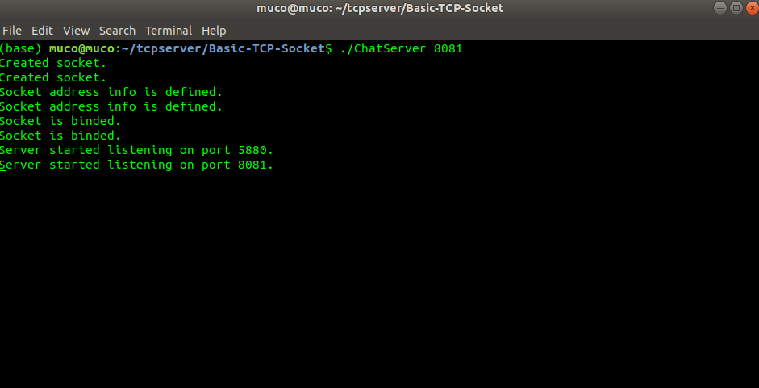

# TCP Socket Application
These are the multithreaded TCP server and client applications written in C for Linux environment. Programs support authentication and message encryption(base64). When connection between server and client is established, send and receive functions run on different thread so main loop keeps running for new connections.
## How to compile?
While compiling, you need to specify the libraries that used for multithread and cryptography.
```
$ gcc ChatServer.c -o ChatServer -lpthread -lssl -lcrypto
$ gcc ChatClient.c -o ChatClient -lpthread -lssl -lcrypto
```
## How to use?
 ![2][screenshots/2.png]
